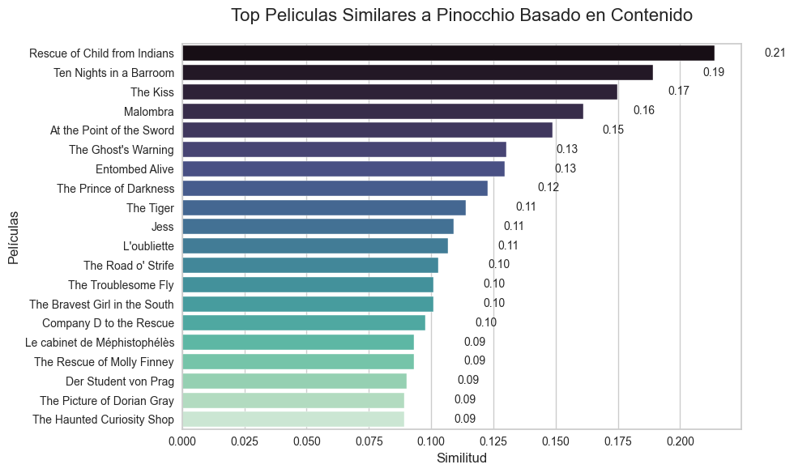
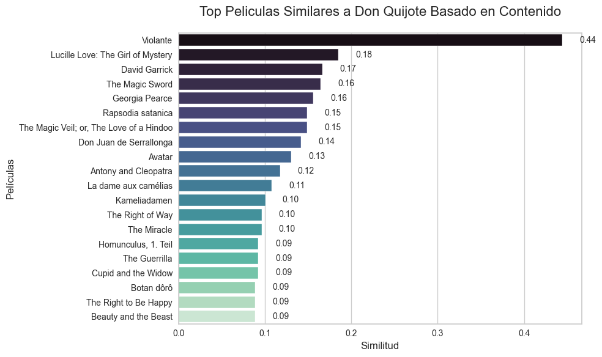
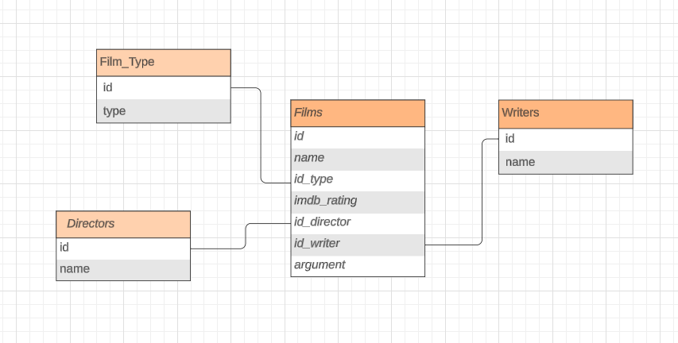

# CinemAnalytics: Explorando el Cine a través de Datos y Tecnología

## 1. Resumen

Nos ha contratado una plataforma de streaming para mejorar la calidad de su contenido y la experiencia de sus usuarios. Este proyecto tiene como objetivo aplicar técnicas de análisis de datos para identificar las películas y cortometrajes más populares y mejor valorados desde 1990 hasta la fecha, además de desarrollar un sistema de recomendación para personalizar la experiencia de los usuarios.

### Objetivos principales:
- Identificar las películas y cortometrajes más destacados en la plataforma basándose en calificaciones, número de visualizaciones y reseñas.
- Analizar la evolución de las preferencias de los usuarios a lo largo de los años para identificar tendencias clave en la industria cinematográfica.
- Diseñar y desarrollar un sistema de recomendación para sugerir contenido relevante a los usuarios.
- Proporcionar recomendaciones específicas para la promoción de contenido en las distintas secciones de la plataforma.

---

## 2. Fases del Proyecto

### [Desglose de las fases y Requerimientos](https://github.com/DataScienceOct24/project_z)
 

## 3. Conclusiones

Tras extraer datos mediante apis y web scraping las cuales se pueden [ver en mis notebooks](https://github.com/joseluisalmendral/Prueba_Tecnica/tree/master/notebooks), he tratado y vectorizado los datos para realiar un sistema de recomendación basado en contenido.

Ejemplos: 

#### *Ha quedado pendiente* la creación de la base de datos mediante código por falta de tiempo.

 Pero he realizado un esquema de la estructura que tendría en base a mis datos.

## 4. Next Steps

 - Pillar más datos de películas desde la API para aumentar los datos de nuestra muestra y poder enriquecer más el modelo de recomendación.
 
 - Tratar mejor la limpieza y el tratamiento de las duraciones de la películas en su recopilación.
 
 - Implementar la Fase3, terminar la Fase5 y realizar las fases 6 y 7.
